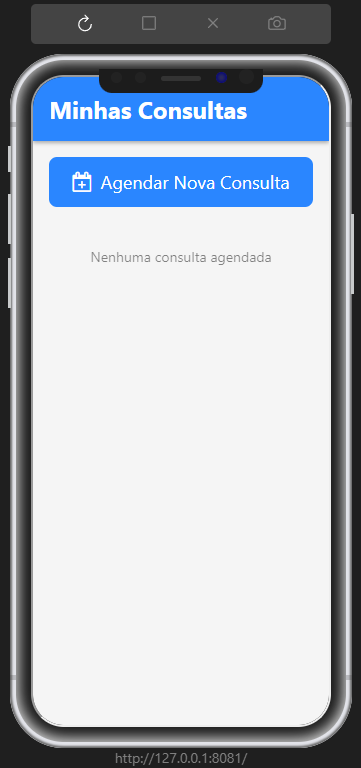
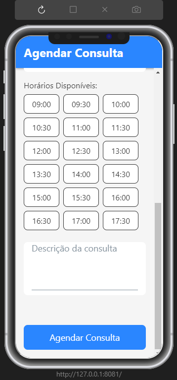
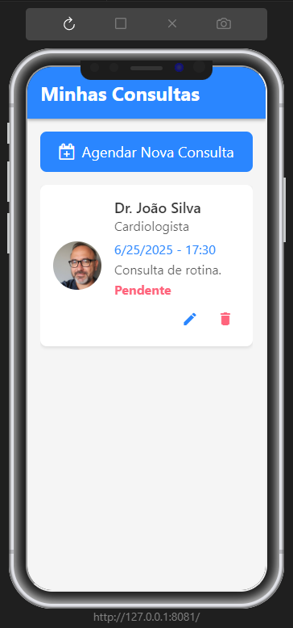

# 📅 Marcação de Consultas Médicas

Este é um aplicativo mobile desenvolvido com **React Native + TypeScript** que permite aos usuários **marcar, visualizar e gerenciar consultas médicas** de forma simples e intuitiva.

## 📋 Autor do projeto

- **Natan Eguchi dos Santos**
- **RM98720**


## 🚀 Funcionalidades

- 📄 Cadastrar nova consulta médica
- 📋 Listar consultas agendadas
- 👤 Tela de perfil do usuário
- 🧭 Navegação entre telas (Home, Criar Consulta, Perfil)
- 💾 Armazenamento local simulado (mock)

## 🛠️ Tecnologias Utilizadas

- [React Native](https://reactnative.dev/)
- [TypeScript](https://www.typescriptlang.org/)
- [React Navigation](https://reactnavigation.org/)
- [Expo](https://expo.dev/) 

## ▶️ Como Executar

1. Clone este repositório:
   ```bash
   git clone https://github.com/seu-usuario/marcacaoDeConsultasMedicas.git
   cd marcacaoDeConsultasMedicas
   ```

2. Instale as Dependências:
    ```bash
    npm install
    ```

3. Inicie o projeto com Expo:
    ```bash
    npx expo start
    ```

</br>

**Certifique-se de ter o Expo CLI instalado (npm install -g expo-cli) e o app Expo Go no seu celular para testar o app via QR code.**

## 📸 Prévias






## 👨‍⚕️ Sobre o Projeto
- Este app foi desenvolvido com fins educacionais ou como uma prova de conceito de um sistema de marcação de consultas médicas no ambiente mobile.